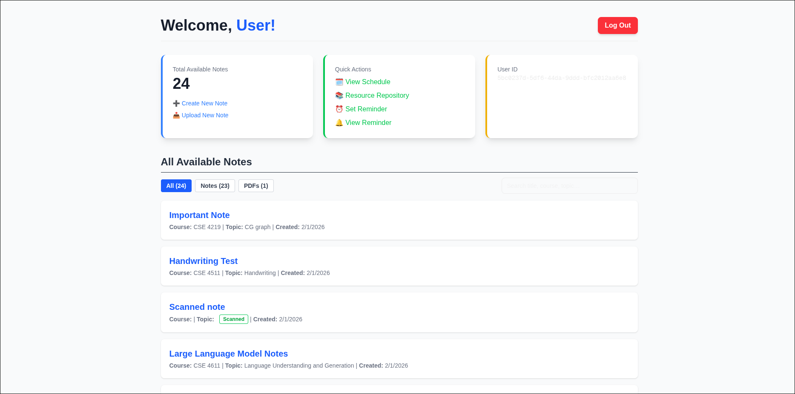
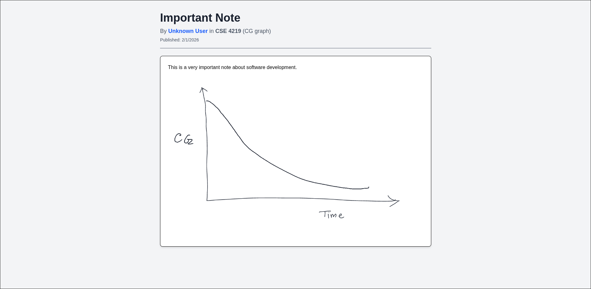
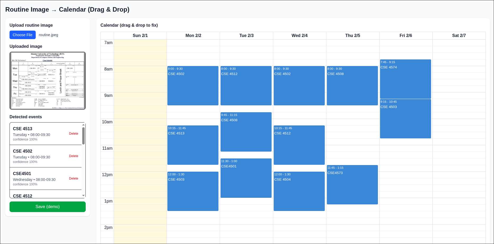
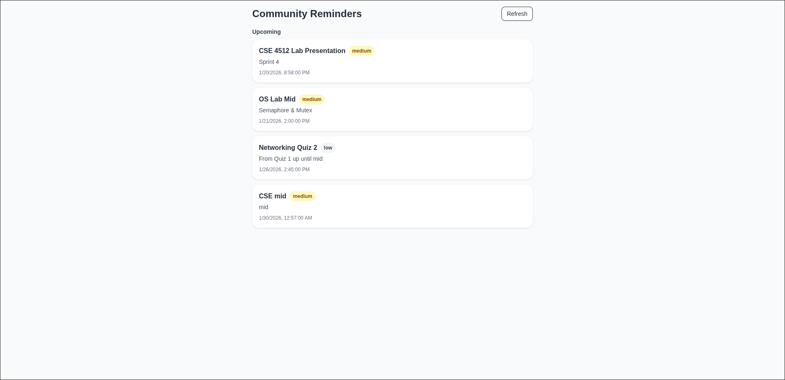
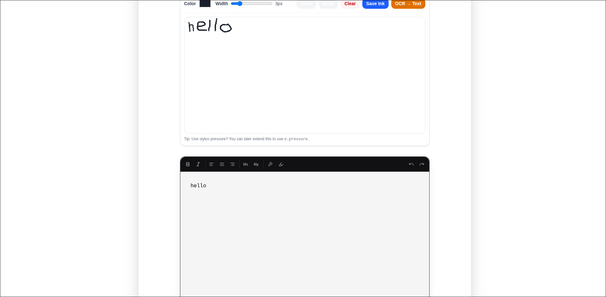
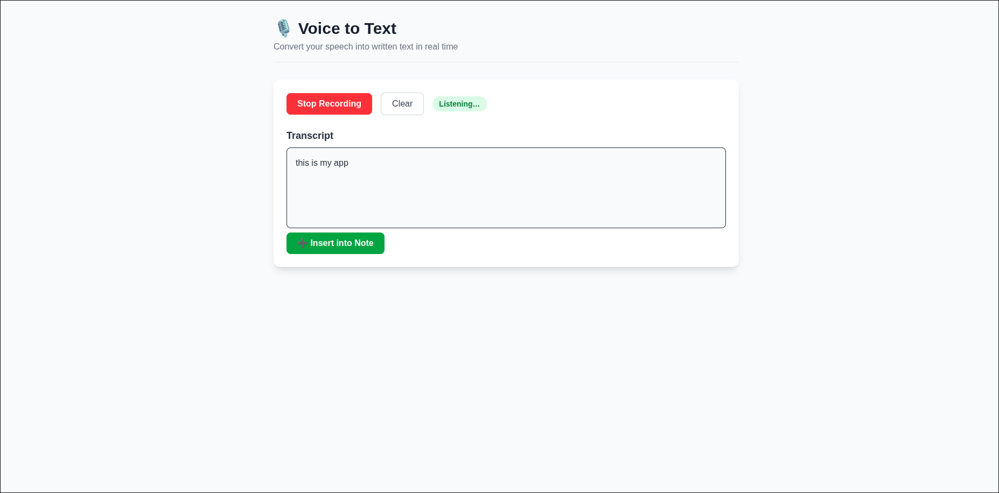
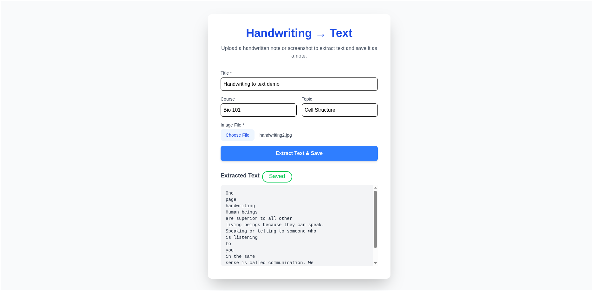

# Acadex
 <br/>
Acadex is a unified workspace designed to streamline your productivity with notes, resources, and scheduling tools. Built with modern web technologies, it offers a seamless experience for managing your academic and personal life.

## Features

- **Authentication & Security**: Secure user authentication powered by [Supabase](https://supabase.com/).
- **Rich Text Notes**: Create and edit formatted notes using [Tiptap](https://tiptap.dev/), a headless editor framework.
- **Smart Scheduling**: Integrated calendar functionality with [FullCalendar](https://fullcalendar.io/) for managing events and deadlines.
- **OCR Capabilities**: Extract text from images using [Tesseract.js](https://github.com/naptha/tesseract.js) (via `node-tesseract-ocr`).
- **Media Management**: Efficient image uploads and hosting provided by [Cloudinary](https://cloudinary.com/).
- **Responsive Design**: Built with [Tailwind CSS 4](https://tailwindcss.com/) for a beautiful, mobile-first interface.

## Tech Stack

- **Framework**: [Next.js 15](https://nextjs.org/) (App Router)
- **Language**: [TypeScript](https://www.typescriptlang.org/)
- **UI Library**: [React 19](https://react.dev/)
- **Styling**: [Tailwind CSS 4](https://tailwindcss.com/) & [Shadcn UI](https://ui.shadcn.com/)
- **Backend/Database**: [Supabase](https://supabase.com/)
- **Deployment**: Vercel (Recommended)

## Demo
Dashboard

Notes

OCR Schedule Creator

Reminders

Note Creator

Handwriting to Text Live

Voice to Text

Handwriting to Text From Image/PNG or PDF


## Getting Started

Follow these steps to set up the project locally.

### Prerequisites

Ensure you have the following installed:
- [Node.js](https://nodejs.org/) (v20+ recommended)
- [npm](https://www.npmjs.com/) or [yarn](https://yarnpkg.com/)

### Installation

1.  **Clone the repository:**

    ```bash
    git clone <repository-url>
    cd acadex
    ```

2.  **Install dependencies:**

    ```bash
    npm install
    # or
    yarn install
    # or
    pnpm install
    ```

3.  **Environment Setup:**

    Create a `.env.local` file in the root directory and add the following environment variables. You will need credentials from Supabase and Cloudinary.

    ```bash
    # Supabase
    NEXT_PUBLIC_SUPABASE_URL=your_supabase_url
    NEXT_PUBLIC_SUPABASE_ANON_KEY=your_supabase_anon_key
    SUPABASE_URL=your_supabase_url
    SUPABASE_SERVICE_ROLE_KEY=your_supabase_service_role_key

    # Cloudinary
    CLOUDINARY_URL=your_cloudinary_url

    # Web Push (if applicable)
    NEXT_PUBLIC_VAPID_PUBLIC_KEY=your_vapid_public_key
    ```

4.  **Run the development server:**

    ```bash
    npm run dev
    ```

    Open [http://localhost:3000](http://localhost:3000) with your browser to see the result.

## Project Structure

A quick look at the top-level files and directories you'll encounter in this project:

-   `app/`: Contains the application routes, layouts, and pages (Next.js App Router).
-   `components/`: Reusable UI components.
-   `lib/`: Library code, third-party client initializations.
-   `utils/`: Utility functions and helpers.
-   `public/`: Static assets like images and fonts.
-   `types/`: TypeScript type definitions.

## Learn More

To learn more about the technologies used in this project:

-   [Next.js Documentation](https://nextjs.org/docs)
-   [Supabase Documentation](https://supabase.com/docs)
-   [Tailwind CSS Documentation](https://tailwindcss.com/docs)
